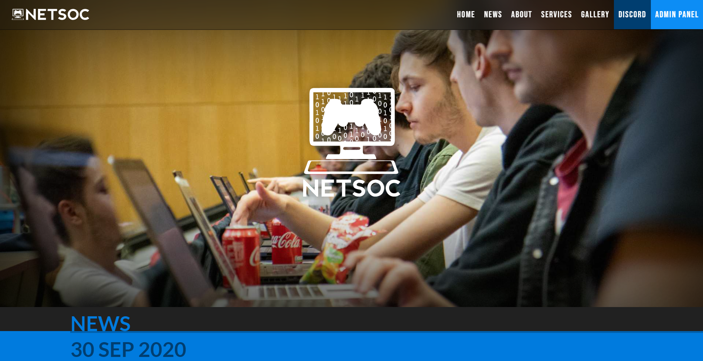
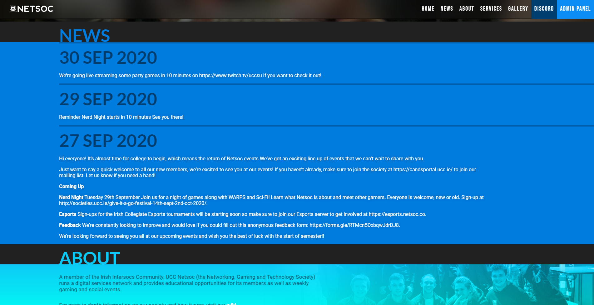
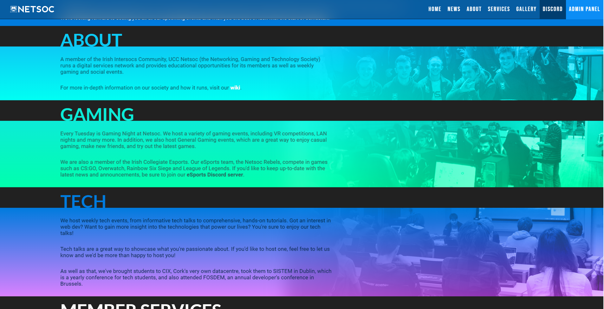

# 

Our new fancy website. Made with React and Typescript.

## Screenshots

## Local development

1. Ensure you have the prerequisits: Node.js, NPM, Docker and docker-compose

1. Pull this repo
1. Pull the [dev-env](https://github.com/UCCNetsoc/dev-env) into another directory
1. `cd` into the dev-env and run `./start-website.sh /path/to/this-repo` or `./start-website.sh /path/to/this-repo bot` if you want to use the local bot.
1. To open in chrome:
   - Close all chrome instances
   - On Windows: Run`"C:\Program Files (x86)\Google\Chrome\Application\chrome.exe" --proxy-server="socks5://localhost:1080"`
   - On Linux: Similar to above, just use your chrome path
   - Go to http://netsoc.local/

Thanks for contributing :)
